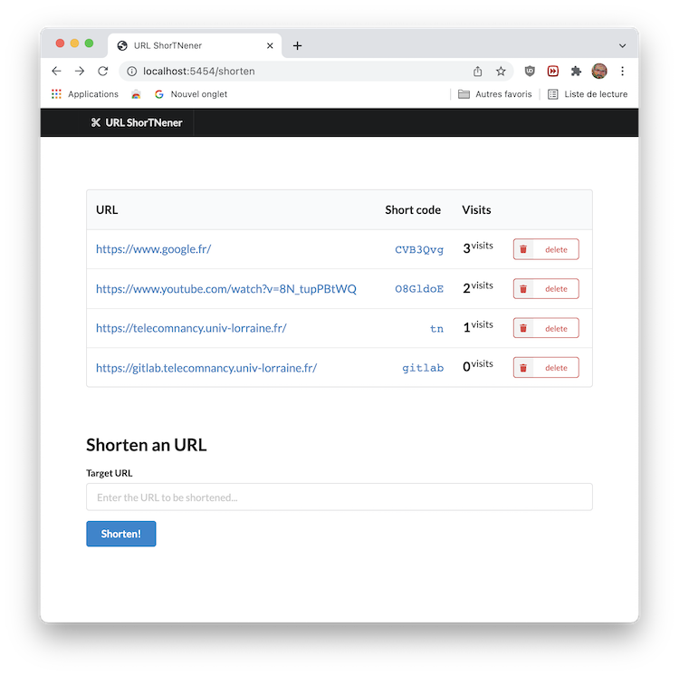
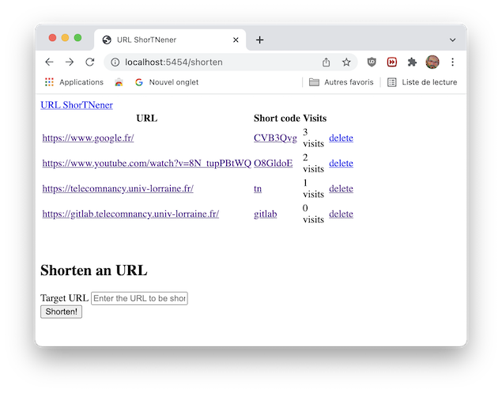

# CS54 Lab Examen#4 - Web Programming


## Objectifs et Attendus

L'objectif de cette séance de travaux pratiques évaluées est de réaliser une application web offrant un service de réduction d'URL (URL shortener)


> *Le principe général de la réduction d'URL consiste à assigner une clé unique de quelques caractères à l'URL d'une page web spécifique. Un utilisateur désirant se rendre sur cette page web peut ensuite simplement fournir cette clé à la suite du nom de domaine du service de réduction, qui le redirige (redirection d'URL) alors vers la page appropriée.*
> 
> -- <cite>[Wikipedia - Article 'Réduction d'URL'](https://fr.wikipedia.org/wiki/R%C3%A9duction_d%27URL)</cite>





### Mise en place de votre environnement

Il vous est demandé :
- de mettre en place un environnement virtuel pour votre développement.
- d'y installer les librairies dont vous avez besoin (a minima la librairie `Flask`)
- de sauvegarder la liste de vos dépendances dans un fichier `requirements.txt` (pour rappel, cela peut être réalisé en utilisant la commande `pip freeze > requirements.txt`).
- de penser à mettre à jour ce fichier de dépendances si vous installez plus tard d'autres dépendances.
- d'ajouter, de committer et de déposer (*pousser*) sur le serveur gitlab ce premier commit. 
  
> ⚠️ **Attention** Vous ne devez pas ajouter et committer le contenu du répertoire contenant votre environnement virtuel.


### Les bases de votre serveur web

Le code principal de votre serveur web devra se trouver dans un fichier Python dénommé `app.py`.

Lors de l'évaluation, nous exécuterons votre serveur en utilisant les commandes suivantes :
```bash
# creation d'un environnement virtuel spécifique à l'évaluation
$ python3 -m venv venv-eval --prompt evaluation
$ source venv-eval/bin/activate

# installation des dépendances
$ pip install -r requirements.txt

# exécution du serveur sur le port 8080 de l'hôte local
$ flask run --host=0.0.0.0 --port=5454
```


## Questions





## Quelques liens utiles

- le serveur [gitlab : http://gitlab.telecomnancy.univ-lorraine.fr/](http://gitlab.telecomnancy.univ-lorraine.fr/) de l'école
- la [page du cours CS54](https://arche.univ-lorraine.fr/course/view.php?id=39557) sur Arche
- la [page officielle de la librairie Flask](https://flask.palletsprojects.com/en/2.0.x/)
- le [tutoriel officiel de la librairie Flask](https://flask.palletsprojects.com/en/2.0.x/tutorial/)

### Gestion de versions (git)

Il vous est demandé :
- de *cloner* le dépôt présent sur la plateforme GitLab de l'école pour travailler en local sur votre machine personnelle ou une machine de l'école
- de *committer* chacune de vos versions de vos programmes et de *pousser* **régulièrement** ces commits sur la plateforme GitLab

Prenez l'habitude d'associer à vos commits des messages pertinents qui décrivent le contenu des modifications apportées par le commit.

### Bonnes pratiques de développement

Vous veillerez à documenter/commenter le code Python que vous écrivez. Chaque fonction que vous définissez devrait être associée à commentaire pour préciser : le type et le sujet de chaque paramètre ; le type et la valeur de retour de la fonction ; les pré-conditions (et éventuellement post-conditions) de cette fonction.

Vous pouvez utiliser si vous le souhaitez :
- des [indications de types (*Type Hinting*)](https://docs.python.org/3/library/typing.html) disponibles depuis Python 3.5+ (https://docs.python.org/3/library/typing.html) et définis dans la [PEP 484](https://www.python.org/dev/peps/pep-0484/). Ils vous permettent d'annoter des types à vos paramètres, valeur de retour ou encore variables.
- les [*docstrings* (PEP 257)*](https://www.python.org/dev/peps/pep-0257/)
